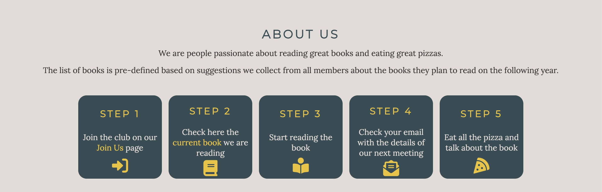

# Everything is Better With Pizza Book Club 🍕📚

Everything is Better With Pizza Book Club is a site that hopes to connect people in Dublin, Ireland who are passionate about reading and love eating pizza. The book club runs on a montly basis. There is a book selected to each month and the meetings happen at a different pizza place every month. 

Users of this website will find all the information about the club. On the home page we have: About the club, how it works, meetings, contact and follow us. On the 2023 Picks we have a list of all the books planned for 2023. On the Join Us page there is a sign up form. This site is target at people who love reading and share another commom interest: pizza. 🍕

***

## Features

- Navigation
    - It's on the top of every page. On the left shows the book club logo which is a link to the home page.
    - On the right side we have three other links: Home to the home page, 2023 Picks to the page that contains all the books chosen for 2023, and Join Us the page with the form to sign up for the group.
    - The navigation is the same for every page. The only thing that changes is that the current page is underlined.
    - When the mouse hover on the links, the font size increases and they become underlined.

    

- Landing Page
    - The landing page includes an image of a book and a pizza slice with a text on the right end corner with the name of the club and some short explanation of what the club is about.

    

- About Us
    - The about us section gives an explation about how the club works.
    - It contains five boxes showing the 5 steps to be done to join the club.

    

- Meetings
    - The meetings sections explains how often meetings occur.
    - It has three images that demonstrating examples of meetings.

    

- Contact
    - The contact section is divided in two.
    - The first part contains the Contact Us information with phone and email.
    - The second part is Follow Us which contains icons which are links for the club social media: Facebook, Twitter, Instagram and Youtube.

    

- Footer
    - The footer is the same for all pages and it is located on the end of all of them.
    - It contains the copyright mark and the name of the club.
    - After that we have information about the developer.
    - In the end we have two icons as links for the developer's GitHub and LinkedIn profiles.

    

- 2023 Picks
    - This page contains all the books that are going to be read in 2023 by the club.
    - It contains 12 boxes, each representing a month.
    - Every box contain the name of the month, a picture of the book, the name of the book, the author and a button with the link to buy the book on Amazon.
    - The button contains the amazon logo and change colors when the mouse hover it.

    

- Join Us
    - The join us page has the form to join the group.
    - The form has three inputs: first name, last name and email.
    - The form also have a submit button.

    

- Thank You
    - The thank you page is showed after the form submission. 
    - It has a thank you message and informs the user that the club will contact them shortly and a link to return to the home page.
    - It shows an image of a person eating pizza and reading a book at the same time.

    

- 404
    - This page is showed when the user try to access a page that does not exist.
    - It has a message informing that the page was not found and a link to return to the home page.
    - The image below shows pizzas boxes with only one slice of pizza left.

    

***

## Testing

- This site was tested on the browsers: Firefox, Chrome and Safari.
- 

## Logo

## Bugs
1. Homepage keeps with an extra margin on the right side.

    I had a margin of 2rem on the about-us section that was causing the issue. I commented section by section to see which one was causing the issue. I added a 0 on the margin for the sides.
2. Footer was not sticking to the bottom.
    I put bottom: 0, but it still was not working. Devtools showed that it would not be changed with a static position. So I changed the footer position to absolute and width to 100% because it change the width to smaller when I changed the position.
    Changing to absolute worked with pages with less content but not with larger content, so I changed to fixed and it worked.
    Fixed did not work with larger contents. I changed the body to min-height: 100vh; display: flex; flex-direction: column; and added flex-grow: 1 to the join-us section which was the only one that the content did not reach the end for the footer to stay in the bottom as suggested here https://stackoverflow.com/questions/34796085/how-to-stick-footer-to-bottom-not-fixed-even-with-scrolling
    
    

## Books' Images
- January: https://www.amazon.co.uk/N%C3%B6thin-But-Good-Time-Uncensored/dp/1250195756
- February: https://www.amazon.com/Fire-Blood-Thrones-Targaryen-History-ebook/dp/B07C6TBTV3
- March: https://www.kobo.com/ie/en/ebook/friends-lovers-and-the-big-terrible-thing-2
- April: https://www.amazon.ca/Find-Your-Why-Practical-Discovering/dp/0143111728
- May: https://www.amazon.co.uk/Storyteller-Tales-Life-Music/dp/139850372X
- June: https://www.amazon.co.uk/AM-Club-Your-Morning-Elevate/dp/1443456624
- July: https://www.amazon.co.uk/First-21-York-Times-Bestseller/dp/1408716119
- August: https://www.amazon.co.uk/Beautiful-World-Where-Are-internationally/dp/0571365426
- September: https://www.amazon.com/Beyond-Wand-Mayhem-Growing-Wizard-ebook/dp/B09ZXMG884
- October: https://www.easons.com/the-midnight-library-matt-haig-9781786892737
- November: https://www.amazon.co.uk/Madly-Deeply-Alan-Rickman-Diaries/dp/1838854797
- December: https://www.goodreads.com/book/show/57425158-the-opposite-of-butterfly-hunting

## Help
- Add the hand to the cursor on the buy button: https://developer.mozilla.org/en-US/docs/Web/CSS/cursor

***

## Wireframes

### Desktop

### Mobile

